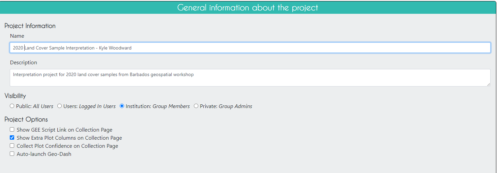

# Sample-Based Map Validation and Area Estimation with CEO

## Overview

In this workflow, we will create a stratified random sample of a land cover map, and use to conduct an accuracy assessment and area estimate of the strata in the land cover map.  We will make the stratified random sample in GEE, collect validation data at those points in CEO, and then calculate error matrices and estimate the true area of each land cover stratum in Google Sheets or Microsoft Excel.

# Export Classification Map in GEE

In the [Land Cover Mapping](https://servir-amazonia.github.io/barbados-training/landcover-mapping-gee) module, we made a random forest land cover classification for 2020. That land cover product has been exported for us to use in this workshop by adding in an `Export` function at the bottom of last workshop's script. ([script link]((https://code.earthengine.google.com/?accept_repo=users%2Febihari%2FSurinameWS&scriptPath=users%2Fkwoodward%2Fcaribbean-trainings%3Abarbados-trainings%2FLandCoverMappingLandsat_CopernicusRefData))).  


# Create Validation Points in GEE

In the new GEE script you created called **Map Validation - Sample Design**, import the land cover classification asset.

```javascript
//--------------------------------------------------------------
// Import Classification Map
//--------------------------------------------------------------

// import land cover classification from previous activity 
var LC = ee.Image('projects/caribbean-trainings/assets/barbados-2022/images/LandCover2020_Landsat');

// Define visualization parameters
var visParam = {min:1,
max:8,
palette:[
'f096ff', // ag - pink
'b4b4b4', // bare - grey
'ffff4c', // herbaceous - yellow
'007800', // forest - green
'ffbb22', // shrub - orange
'fa0000', // urban - red 
'0032c8', // water - blue
'0096a0' // wetland - teal
]};

// add classified image to map
Map.addLayer(LC, 
             visParam, 
            'RF landcover classification');
            
Map.centerObject(LC.geometry(), 12);
```

Then, we create a stratified random sample with 10-20 points in each of the 8 land cover classes.  In a real project, you would want to collect many more validation points for this big of an AOI, but we will keep it simple for this exercise.

```javascript
//--------------------------------------------------------------
// Create Stratified Random Sample
//--------------------------------------------------------------

/* create stratified random sample from the land cover classification map
 values in 'class' property: 
 1: 'agriculture',
 2: 'bare',
 3: 'herbaceous',
 4: 'forest',
 5: 'shrub',
 6: 'urban',
 7: 'water',
 8: 'wetland'
*/
var samplePts = LC.stratifiedSample({
  // total # points
  numPoints:50, 
  classBand:'classification', 
  region:LC.geometry(), 
  scale:30, 
  projection:'EPSG:4326', 
  seed:1010, 
  classValues:[1,2,3,4,5,6,7,8],
  // # points in each class
  classPoints:[10,20,10,10,10,10,20,20], 
  dropNulls:true, 
  tileScale:2, 
  geometries:true});
print('Sample points:', samplePts);
print('Breakdown:',samplePts.aggregate_histogram('classification'));
// Add points to the map
Map.addLayer(samplePts,{},'sample points');
```

 

Now, we export these sample points as a Google Drive file in .csv format.  We need to do some extra formatting to get the data in a format that CEO and SEPAL will accept.  We need to add columns called `PLOTID`, `LON`, `LAT`, `SAMPLEID`, and `classification_readable` (which is just a column for the classification values in a readable format ("forest", "water", etc.), and will come in handy when doing our final analysis).

```javascript
//--------------------------------------------------------------
// Export Stratified Random Sample
//--------------------------------------------------------------

// create a dictionary to store class names
var classLookup = ee.Dictionary({
  1: 'agriculture',
  2: 'bare',
  3: 'herbaceous',
  4: 'forest',
  5: 'shrub',
  6: 'urban',
  7: 'water',
  8: 'wetland'
});

// write a function to rename the columns 
// so that the format is accepted by CEO
function ceoClean(f){
  // LON,LAT,PLOTID,SAMPLEID, readable classification column
  var fid = f.id();
  var coords = f.geometry().coordinates();
  var classValue = f.get('classification');
  var className = classLookup.get(classValue);
  return f.set('LON',coords.get(0),
               'LAT',coords.get(1),
               'PLOTID',fid,
               'SAMPLEID',fid,
               'classification_readable', className);
}
// print("First sample point:",ee.Feature(samplePts.map(ceoClean).first()));

// map that function to the sample points feature collection
var samplePts_CEO = samplePts.map(ceoClean);

print('Sample points with PLOTID and readable class:', samplePts_CEO);

print("Class labels and number of samples:",
      samplePts_CEO.aggregate_histogram('classification_readable'));

// Export points as a CSV to Google Drive to use in further analysis
Export.table.toDrive({
  collection: samplePts_CEO,
  description: 'todrive_LCsamplepoints2022',
  fileNamePrefix: 'LCsamplepoints2022',
  selectors: 'LON,LAT,PLOTID,SAMPLEID,classification,classification_readable'
});
```

Additionally, we need to calculate class areas based on the map to use later in our later analysis. This block of code uses the `ee.Reducer.count()` function to count the number of pixels in each class.  It then stores these values in a `List` of `Dictionaries`.  Each `Dictionary` in this `List` has 2 keys: the `class` and the `count`.  Last, it uses this `List` to create a new `FeatureCollection` with 5 empty features in it (one for each class), and attaches the correct `class` and `count` as properties to each feature.  Thus, we end up with a data type that can be exported as a .csv, and it contains a separate row for each class and a separate column containing the pixel counts of those classes.

``` javascript
//--------------------------------------------------------------
// Calculate Class Areas
//--------------------------------------------------------------

// Create an extra image with a value of 1 in every pixel
// covering the same geometry as the land cover map
// (this is just an something needed for the ee.Reducer.group() function 
// because it needs an image with 2 bands)
var constantImage = ee.Image(1).clip(LC.geometry());

// Calculate the number of pixels in each class
var pixelCounts_dict = constantImage.addBands(LC).reduceRegion({
  // Use ee.Reducer.count().group() function
  reducer: ee.Reducer.count().group({
    // Use band "class" for grouping 
    // (which is now band 1 not 0 since we attached the extra image)
    groupField: 1, 
    groupName: 'class',
  }),
  geometry: LC.geometry(), // region of interest
  scale: 30, // Resolution of the image in meters
  maxPixels: 1e50 // Maximum number of pixels in the region
});

// Print the resulting dictionary of a list of dictionaries
print("Pixel Counts as Dictionary", pixelCounts_dict);

// Convert the this dictionary to just a list of dictionaries
// (we extract the list of dictionaries)
var pixelCounts_list = ee.List(pixelCounts_dict.get('groups'));

// Print the resulting list of dictionaries
print("Pixel Counts as List of Dictionaries", pixelCounts_list);

// Create a FeatureCollection from the list of dictionaries
var pixelCounts_fc = ee.FeatureCollection(
  // apply this function to all the dictionaries in the list
  pixelCounts_list.map(function(dict) {
    var dict2 = ee.Dictionary(dict);
    // extract the className from the dictionary
    var className = ee.Number(dict2.get('class'));
    // extract the count from the dictionary
    var count = ee.Number(dict2.get('count'));
    // put these into an empty feature class as new properties
    // (this allows us to export the info as separate columns in a CSV)
    return ee.Feature(null, {
      'class': className,
      'count': count
    });
  })
);

// Print the resulting FeatureCollection
print("Pixel Counts as FeatureCollection", pixelCounts_fc);

//--------------------------------------------------------------
// Export Class Areas
//--------------------------------------------------------------

// Export the FeatureCollection as a CSV to Google Drive for further analysis
Export.table.toDrive({
  collection: pixelCounts_fc,
  description: 'todrive_LCpixelcounts2020',
  fileNamePrefix: 'LCpixelcounts2020',
  fileFormat: 'CSV'
});
```

Now, when we run our code, these export tasks should appear in the **Tasks** tab.  


Click **Run** on the task, filling out the names and locations you want the files to be put.


Once the tasks have finished running, we can open the exported .csv files in Google Drive by clicking **Open in Drive** in the **Tasks** tab.


From your Google Drive, download these .csv files to your computer.

*Extra: Adding a legend in Code Editor.*

``` javascript
//--------------------------------------------------------------
// Add Legend
//--------------------------------------------------------------

// Set position of panel
var legend = ui.Panel({
  style: {
    position: 'bottom-right',
    padding: '8px 15px'
  }
});

// Create legend title
var legendTitle = ui.Label({
  value: 'Land Cover Classes',
  style: {
    fontWeight: 'bold',
    fontSize: '18px',
    margin: '0 0 4px 0',
    padding: '0'
    }
});

// Add title to legend panel
legend.add(legendTitle);
    
// Write a fcuntion that creates and styles 1 row of the legend
var makeRow = function(color, name) {
      
      // Create the label that is actually the colored box
      var colorBox = ui.Label({
        style: {
          backgroundColor: '#' + color,
          // Use padding to give the box height and width
          padding: '8px',
          margin: '0 0 4px 0'
        }
      });
      
      // Create the label that is the description text
      var description = ui.Label({
        value: name,
        style: {margin: '0 0 4px 6px'}
      });
      
      // Return the panel
      return ui.Panel({
        widgets: [colorBox, description],
        layout: ui.Panel.Layout.Flow('horizontal')
      });
};

// list with the class colors
var palette = visParam.palette;

// list with class names
var names = [
'agriculture',
'bare',
'herbaceous',
'forest',
'shrub',
'urban',
'water',
'wetland'
];


// Add color and and names to legend panel
for (var i = 0; i < names.length; i++) {
  legend.add(makeRow(palette[i], names[i]));
  }  

// Add legend to map (alternatively you can also print the legend to the console)  
Map.add(legend);   
```

Code Checkpoint: [https://code.earthengine.google.com/130e01e220183c65ef8e2010baac37b6?accept_repo=users%2Febihari%2FSurinameWS](https://code.earthengine.google.com/130e01e220183c65ef8e2010baac37b6?accept_repo=users%2Febihari%2FSurinameWS)

# Collect Validation Data in CEO

Log in to CEO.  On the main CEO page, in the search bar at the top left, search for an institution called “Barbados Geospatial Workshop.” Click `Visit`. 

*If the Institution does not show, expand the filters window and check the 'Show Empty Institutions' check-box.* 


## Join the Instituion

Click the Users tab, and click the `+ Request Membership` button. Your trainer will go in and approve everyone's membership and elevate them to the 'Admin' role. 

## Add Imagery to the CEO Institution

On the institution's home page, click on `Imagery`.


Click on the `Add New Imagery` button (it will show up one you have joined the Institution).  Here, you can see how to add a new type of imagery to a project.  There are some data sets already available in CEO, like Sentinel and Planet, but you can also import any public GEE `Image` or `ImageCollection` or any private GEE asset.  You just need its asset ID, a start and end date, and some parameters for its visualization.


## Create a CEO Project

On the institution’s home page, go to the `Projects` tab and click `+ Create New Project`.  The workflow for creating a new project should appear. 


For Name, use this title: 'Land Cover Sample Interpretation - YOUR NAME' - and use your own name. This way, everyone in the workshop will have their own project to work in and we can discern the differences.  



Click `Next`.

On the `Imagery Selection` page, you can change the imagery that will be available when collecting data.  You will see the default CEO imagery data sets under `Public Imagery`, as well as the imagery data sets you or someone else manually uploaded to your institution under `Private Institution Imagery `.


On the `Plot Design` page, we need to upload the .csv file with the validation points that was exported from GEE. We choose a square plot shape with a 30m width, reflecting the default size and shape of a Landsat pixel.


Click `Next`.

On the `Sample Design` page, we can control how samples are generated within a plot. There are many options here, but for simplicity we will choose a 'Center' spatial distribution, meaning that one sample will be generated per plot (samples and plots are the same using this mode).


Click `Next`.

On the `Survey Questions` page, you can create various types of survey questions related to your plots and samples. You can create parent and child questions so that certain questions only appear if the parent question was answered in a certain way.  You can also organize your questions into survey cards that are presented separately, which is particularly helpful when looking at land use change for different time periods.

For this exercise, we have one parent question asking about what the land cover type is and one child question asking if that sample was Forested in a specific previous year, which will only appear if the analyst answers 'forest' to the parent question.


Click `Next`.

`Survey Rules` is the last page before review, and we will skip it for this exercise. However, you can create rules related to your survey questions to control the quality of your survey answers. See the [CEO Guide - Creating a Project](https://servir-amazonia.github.io/barbados-training/ceo/04_CEO-creating-project.html) page for more information on Survey Rules.  

Click `Next`.

On the `Review` page, you can check that everything looks good and create the project.  Check the box agreeing to the terms and conditions, and click `Create Project`.


At this point, you can still edit the project.  In order to start collecting data, you will need to click `Publish Project` on the next page, but you will now lose your ability to edit the plot and sample design.


## Configure the GeoDash

The GeoDash is a dashboard containing graphs and widgets that an analyst can use to aid in their survey response decision-making. We will configure one for our project now. Keep in mind the GeoDash is optional but is often worth the time to configure for your projects.

While on this published project overview page, click `Configure GeoDash` on the right-hand side. You will see a blank page. Click `Add Widget` in the top right. We will create a time series graph of NDVI based on Landsat capturing several years before and through 2020. 
Use the settings in this example, or feel free to change them. Then, click `Create`. You'll then see a dummy widget populated in your Dashboard with your chosen Title. You can close the GeoDash configuration tab that you have open - your changes are saved.


## Collect Data in the CEO Project

Now that you have published your project, go back to the institution home page and click on your project you just created to start collecting data.  It should be red before you start collecting data, yellow after you start collecting data, and green when you finish collecting data for all plots.


Select `Collect` and click `Go to First Plot`.


It should take you to the first plot.  Here, you can view the original map classiciations in `Plot Information`, as well as all the imagery that was selected for this project in `Imagery Options`. Additionally, if your project is not set up to auto-launch the GeoDash, you can click the `GeoDash` button to launch it yourself for any given plot.


If you want some more high resolution imagery to help in your decision, click `Download Plot KML`.  Now, open this file, and Google Earth Pro will open with the plot geometry already loaded in on top of Google Earth imagery.


Once you have opened Google Earth Pro, click on the clock icon on the toolbar at the top of the screen.  A bar showing a timeline of dates will appear at the top left corner of the screen.  You can use this bar to look at all historical and current Google Earth imagery available for this location. 


Go back to the CEO project.  In `Survey Questions`, select the land cover type of the plot and the percentage of that land cover type within the plot, and click `Save`.  


**It is very important to click `Save` after EVERY plot you finish!**  


When you click `Save`, it should take you to the next plot.  Go through a few plots and answer the survey questions.  When you have done so, click `Quit` to exit data collection mode.

When you are ready to download the analyzed data, go back to the institution home page and click the `S` button to the right of your project.  This will download the data as a .csv file.  The file you download will retain the original columns from the sample points we generated in GEE and uploaded to CEO as a .csv (with `pl_` added to the column name).


**Crowdsourcing Exercise!! We will all collect points in one project to crowdsource our efforts**

Back in the Institutions page, use your trainer's Project and start Collecting. It should take only a few minutes to collect dozens of points together. When you see a message that there are no more plots to analyze we are done! 

Like we've done before, we will then download this project's resulting sample dataset as a CSV from the `Institution` page.

# Assess Accuracy and Estimate Area in Google Sheets

For this section, open this [Barbados workshop Google Drive folder](https://drive.google.com/drive/folders/1m2_2YzSSRNENOJZiNgqIsHg3p5OJSGqi?usp=drive_link). The two spreadsheets we need are the `_DUMMYDATA` Google Sheets document and your GEE pixel count data (.csv).

## Error Matrix

Open the `_DUMMYDATA` file in Google Sheets and **MAKE A COPY** to your own Google Drive. We will use this as a pre-baked example, then you can use this workflow to create your own Accuracy and Area Estimates from real validation data.  

The first sheet contains a completed 'dummy' CEO interpretation dataset - all the CEO interpreted survey answers are made up. Look at the sheet called `error matrix empty`.


Paste the following code into the top left cell, `D4`, and click enter.  Then select this cell and drag to the right across to the final land cover column. It will auto-complete the rest of the row.

```
=COUNTIFS('val-pts'!$N$2:$N, $C4, 'val-pts'!$O$2:$O, D$3)
```


Copy the formula in `D4` and paste it into `D5`. Then click and drag `D5` across the row.
Do this for the rest of the rows. 


### **Question 1**
* **What does this code do?**
* **What do the values in these cells mean?**

Now, for each row, in the sum column we will sum the row's values. The first cell's formula, `L4`, should be `=SUM(D4:K4)`. Then click and drag that cell down to fill in all sum values. Do this sum calculation for the columns as well for the Sum row 


### **Question 2**
* **What does this code do?**
* **What do the values in these cells mean?**

In all the cells in the `producer's accuracy` column, divide the number of correctly categorized samples by the total number of samples (sum) in that class from the **CEO validation data**.


In all the cells in the `user's accuracy` column, divide the number of correctly categorized samples by the total number of samples (sum) in that class from the **GEE classification map**.


*Hint: In cell `D13`, paste the following code. You have to manually do this for each cell.*

```
=D4/D12
```

*Hint: In cell `M4`, paste the following code. You have to manually do this for each cell.*

```
=D4/L4
```

### **Question 3**
* **What does this code do?**
* **What do the values in these cells mean?**

In cell `J10`, add up all the correctly categorized samples and divide by the total number of samples.


*Hint: Paste the following code.*

```
=SUM(D4,E5,F6,G7,H8,I9,J10,K11)/L12
```

### **Question 4**
* **What does this code do?**
* **What do the values in these cells mean?**

You now have a completed error matrix!  You can see what your final error matrix should look like in the `error matrix` sheet.

### **Question 5**
* **Which classes did our random forest classification do well with? Why did the model easily separate out these classes?**
* **Which classes did it struggle with? Why did the model have difficulty separating out these classes?**
* **Which areas were not well sampled in our stratified random sample? (e.g. were all different types of water bodies sampled? were all urban areas sampled well?)**

## Area Estimation

Open the CEO validation data .csv file in Google Sheets.  Open the sheet called `area estimation`.

The first section called `Sample Points Comparison Table` is where you input your data.  The cells inside the top error matrix is where you insert your error matrix values, the column called Sum Strata Pixels is where you insert your pixel count values (from your pixel count .csv).  

**NOTE: The rest of the sheet's formulas are already set up for you You also calculate strata weights based on the percentage of total pixels that are in each stratum.**


The second section called `Area Proportions Comparison Table` is where you calculate the "estimated area proportions" (the proportions of "true" area) for each class based on the number of correctly classified samples in that stratum, the total number of samples in that stratum, and the stratum weight.  You do this separately for each possible combination of classes between the classifiction map and validation points, and then add them all up for each validation point class.  The formula for this might change if your sample design is more complicated.  The area proportions should add up to 100%.


*Cochran, W. G. (1977). Sampling Techniques. New York, NY: Wiley*

The third section called `Uncertainty Estimation` is where you calculate measures of uncertainty, such as the variance, standard error, confidence interval, and margin of error. The formula for these might change if your sample design is more complicated.


*Cochran, W. G. (1977). Sampling Techniques. New York, NY: Wiley*

The fourth section called `Area Estimation` is where you calculate the "true" areas in real-world units.  You multiply the area proportions by the total area of interest and convert it to hectares.  You do the same with the confidence interval, since that is also calculated as a percentage in the previous step.


### **Question 6**
* **Do these area estimates make sense?**
* **How do these area estimated compare to the area estimates from the classification map?**
* **Why is using such a small sample size for validation points not very useful?**

In reality, you will probably use these tools with much more complex data, like land cover classifications with many classes or land cover change maps that capture changes over many years.  You may also have data where the strata in the validation data and the classification data are not exactly the same (e.g. there are more substrata captured in the CEO validation data) - and in this case, you will need to do these calculations in Google Sheets or Microsoft Excel.  SEPAL (the tool we mentioned earlier) can only handle data sets in which the strata are identical between them.

