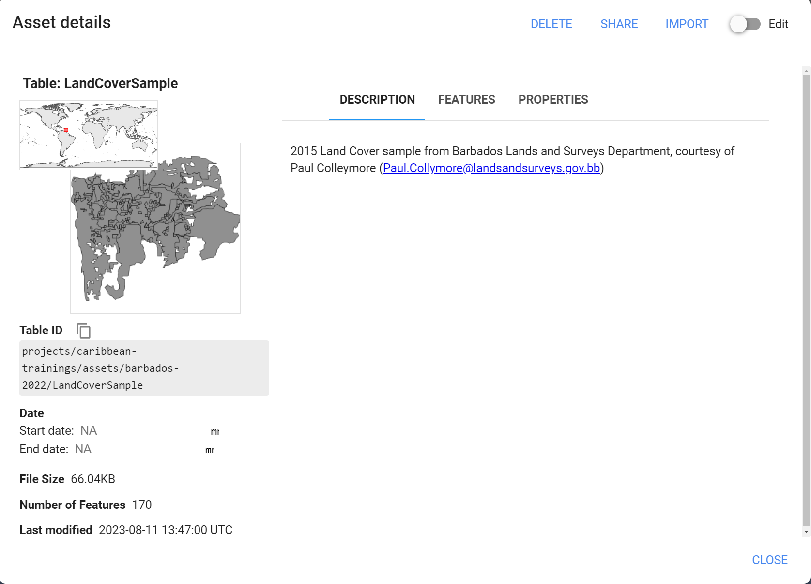

# Overview

You've successfully written a remote sensing workflow to train a Random Forest classification model to map Land Cover with the Landsat archive. Now make it your own! There are several ways to tweak the original workflow right away to change the objective and make improvments. Here are a few ideas. Collaborate with your colleagues and your instructors. Happy Coding!

## Area of Interest (AOI)

We defined our AOI at the beginning of the script using FAO GAUL data. As discussed previously you can define an AOI in GEE in many other ways - like using the Drawing tools or loading in your own layer that you've uploaded to Earth Engine.

## Date Range

After merging together our full Landsat `ImageCollection`, we filtered it on a date range. Come up with another date range that you'd like to map land cover for. Remember that we can also specify a Day of Year range in our filters on the `ImageCollection`. This is useful for areas where there is heavy cloud cover during a certain time of year, or the phenomena you want to map exhibits a specific seasonal pattern that we can sense from satellite data.

## Model Structure

There are several ways we could make our RF model more robust... 

The first is in the number of 'trees' in the Random Forest. You can change that in the `ee.Classifier.smileRandomForest()` function and observe whether any of the accuracy metrics have improved. 

## Sample Data

Beyond the model structure itself, we can also provide more and/or better reference data to the model. The first improvement would be to increase the amount of total samples. Try a number between 200 and 500 per class. 

To provide better quality reference data, we can look for another source of Land Cover data, or make our own. The Barbados Lands & Surveys Department provided a sample of the official 2015 Barbados Land Cover map.  

I have another script, called 
[LandCoverMappingS1S2_BBLandsSurveysRefData](https://code.earthengine.google.com/?scriptPath=users%2Fkwoodward%2Fcaribbean-trainings%3Abarbados-trainings%2FLandCoverMappingS1S2_BBLandsSurveysRefData) that utilizes this dataset with Sentinel-1 SAR + Sentinel-2 Optical training data. Check it out and see if it sparks any ideas.

## Happy Coding!
Do some experimentation, collaborate with your colleagues, ask your instructor questions - Good luck!

*Tip*: The Docs tab is your friend. If you see a function is being used in the script, find that function in the Docs to see what the required arguments are. It'll help you understand how to change the pre-existing functionality. 

