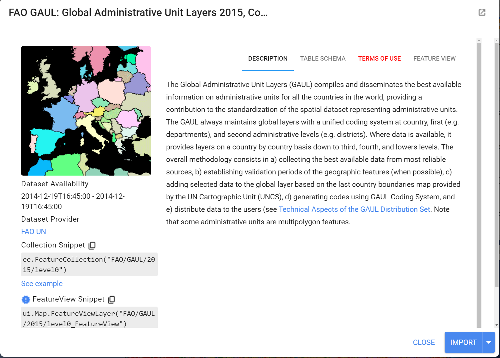
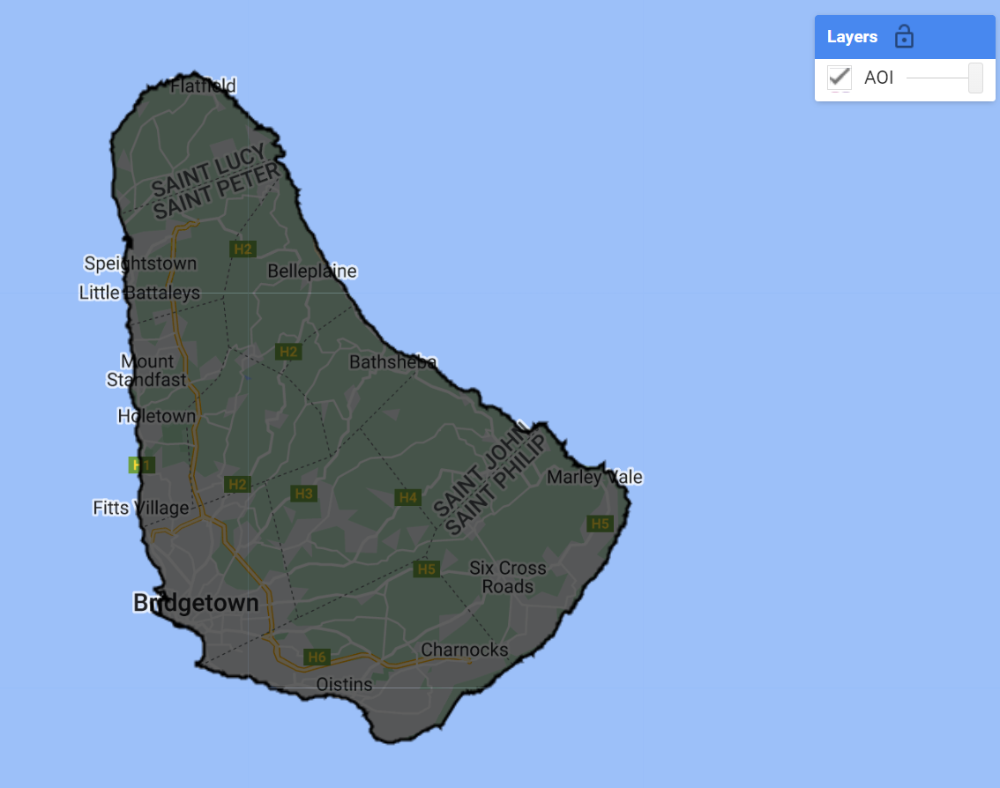
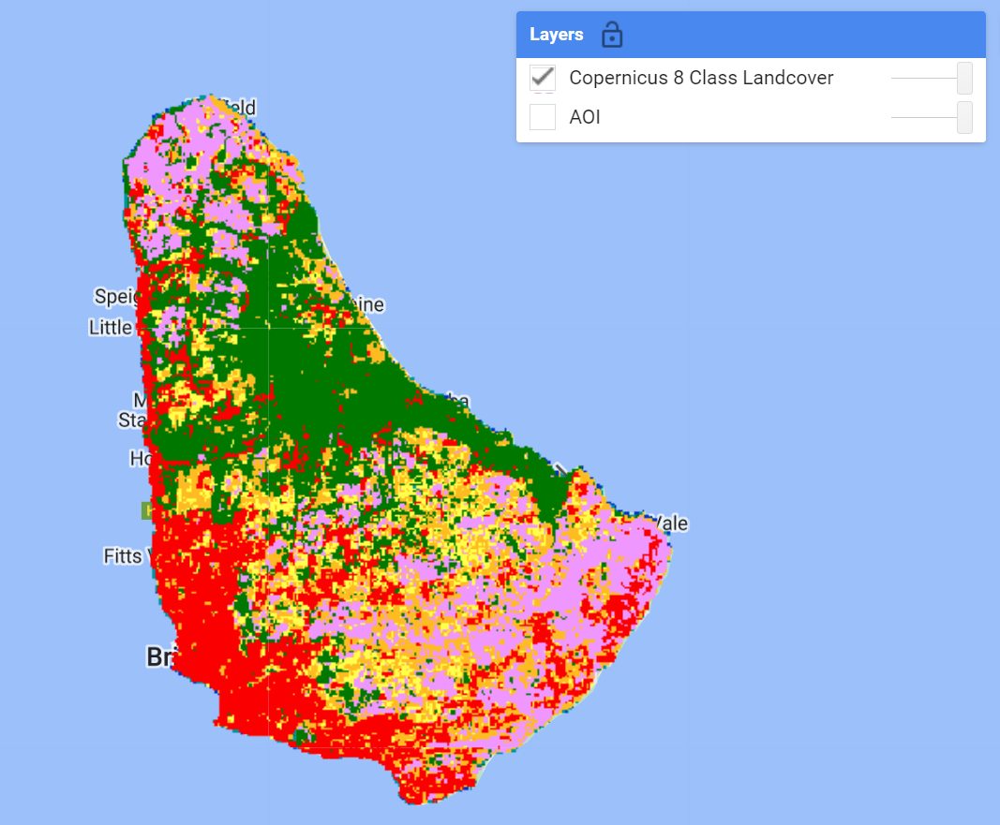
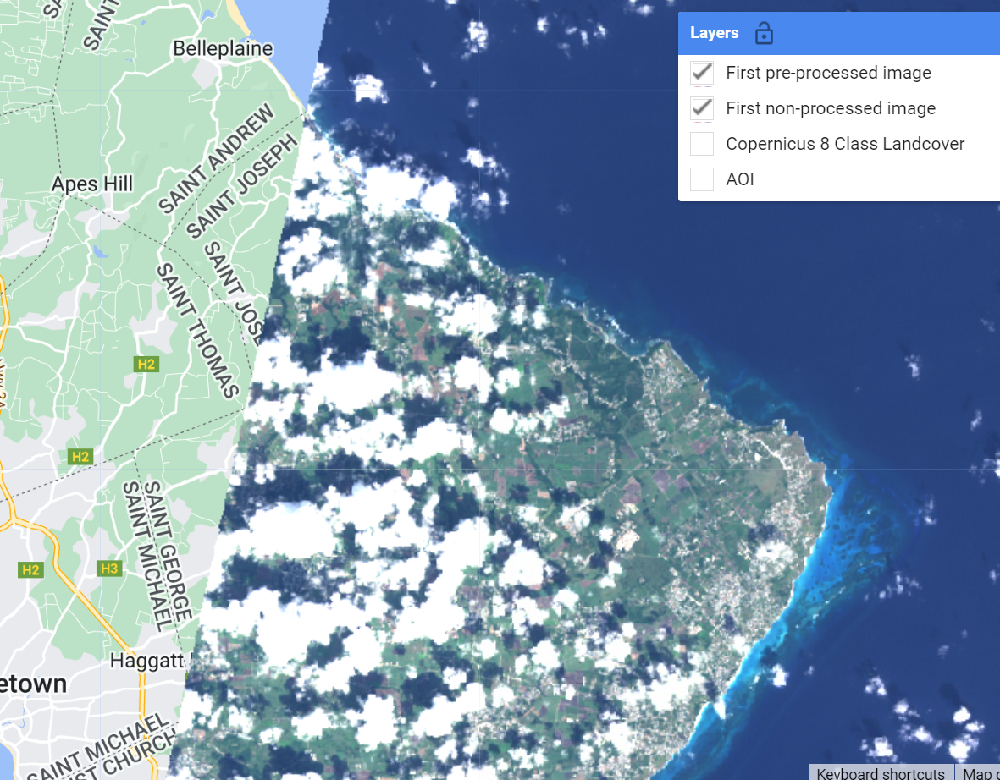
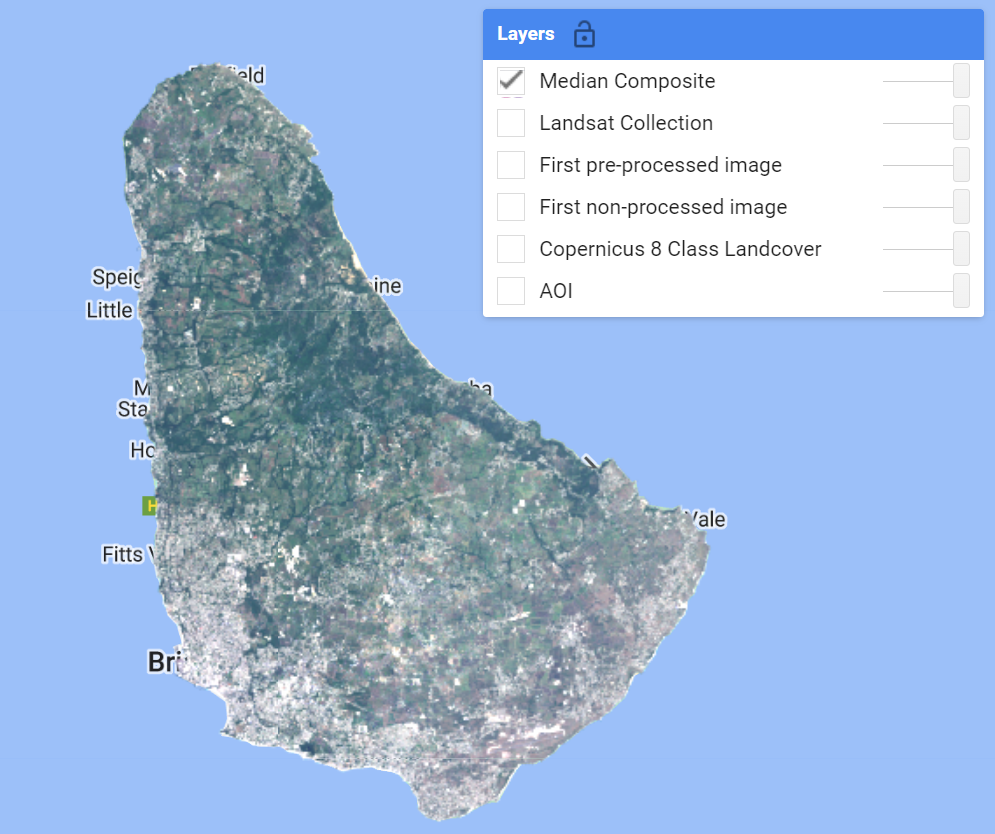

# Step-Through Part 1

# Overview 

In this workflow, we will create an archive of Landsat imagery from Landsat missions 5 through 9, filter the image archive down to a desired time period of interest, then use the data to classify land cover presence using a Random Forest classification model. 

Follow along by copying and pasting each code block in the lesson into your own blank script. At the end you will have the entire workflow saved to a script file on your own GEE account.

# Setting up Area of Interest

An area of interest can be uploaded from a local shapefile, drawn on the map, or derived from a pre-existing dataset in the Earth Engine catalogue. Here we will use the Food and Agriculture Organization's Global Administrative Units Layer (FAO GAUL) dataset to derive our AOI. At the top of the code editor, type in the search bar 'FAO GAUL Global Level 0'. We see that it is a `FeatureCollection` containing global country boundaries.



Click on the `Table Schema` tab. We notice there is a useful field named 'ADM0_NAME'. We will use this property to derive our AOI - the entire country boundary.

```javascript
// Derive an Area of Interest 
var countryName = 'Barbados';

var countries = ee.FeatureCollection("FAO/GAUL/2015/level0");
var aoi = countries.filter(
  ee.Filter.eq('ADM0_NAME', countryName));

Map.addLayer(aoi,{},'AOI',false);
Map.centerObject(aoi,12);
```



# Gathering Reference Land Cover Data

Your reference data can be produced in a number of ways. Two common ones are photo interpretation (digitizing points/polygons over reference basemap imagery), or deriving it from another pre-existing dataset. In this workshop we will do the latter, using the [Copernicus 100m Global Land Cover](https://developers.google.com/earth-engine/datasets/catalog/COPERNICUS_Landcover_100m_Proba-V-C3_Global) dataset that is available in the Earth Engine data catalog. This dataset has a 'discrete_classification' band containing a multi-tiered typology. For demonstration purposes, this much larger classification schema has been collapsed down into a basic 8 Class schema: Agriculture, Bare Land, Herbaceous, Forest, Shrub, Urban, Water, and Wetland. 

We will load this derived dataset.

```javascript
//--------------------------------------------------------------
// Gather Reference Land Cover Data
//--------------------------------------------------------------

/* 
Load Copernicus 100m 8-class Land Cover product from pre-existing asset
(1) Agriculture (pink)
(2) Bare Land (grey)
(3) Herbaceous (yellow)
(4) Forest (green)
(5) Shrub (orange)
(6) Urban (red)
(7) Water (blue)
(8) Wetland (teal)
*/
var refLandCover = ee.Image("projects/caribbean-trainings/assets/barbados-2022/images/CopernicusLC_8Class")
.selfMask(); // mask 0 (not a considered class)

var lcViz = {min:1,max:8,palette:['#f096ff','#b4b4b4','#ffff4c','#007800',
                                  '#ffbb22','#fa0000','#0032c8','#0096a0']};
Map.addLayer(refLandCover,lcViz,'Copernicus 8 Class Landcover');
```



# Preprocessing Image Collections 

We always want to apply filters to `ImageCollections` as early in our workflow as we can to reduce the amount of effort the GEE servers will require. We already know the area that we'd like to pull data for (our AOI), and we can define a date range of images also. 

Since the ultimate goal is to have a combined Landsat archive of Landsat missions 5 through 9, we will define some variables, like the bands to select and rename the same (e.g. 'blue', 'green', 'red), and the cloud cover threshold for our cloud cover filter. In this way, the code for processing each Landsat Image Collection looks almost identical in its structure, with some small key differences.

```javascript
//--------------------------------------------------------------
// Begin Landsat Processing
//--------------------------------------------------------------

// start and end date for imagery filter 
//  can change to create a different composite
var startdate = '2020-01-01';
var enddate = '2020-12-31';
// make a filter date object
var dateFilter = ee.Filter.date(startdate,enddate);

// Each Landsat imageCollection has slightly different ordering of bands 
// handling it with a dictionary saves us some typing
var sensorBandDictLandsatTOA = {'L9': [1, 2, 3, 4, 5, 9, 6, 11],
                                'L8': [1, 2, 3, 4, 5, 9, 6, 11],
                                'L7': [0, 1, 2, 3, 4, 5, 7, 9],
                                'L5': [0, 1, 2, 3, 4, 5, 6, 7]};

var bandNamesLandsatTOA = ['blue', 'green',
                          'red', 'nir', 'swir1', 'temp', 'swir2', 'QA_PIXEL'];

// filter by max cloud cover % in a scene
var metadataCloudCoverMax = 25;

// Landsat 5
var lt5 = ee.ImageCollection('LANDSAT/LT05/C02/T1_TOA')
    .filterBounds(aoi)
    .filter(ee.Filter.lt('CLOUD_COVER', metadataCloudCoverMax))
    .select(sensorBandDictLandsatTOA['L5'], bandNamesLandsatTOA)

// Landsat 7
var le7 = ee.ImageCollection('LANDSAT/LE07/C02/T1_TOA')
    .filterBounds(aoi)
    .filter(ee.Filter.lt('CLOUD_COVER', metadataCloudCoverMax))
    .select(sensorBandDictLandsatTOA['L7'], bandNamesLandsatTOA)

// Landsat 8 
var lc8 = ee.ImageCollection('LANDSAT/LC08/C02/T1_TOA')
    .filterBounds(aoi)
    .filter(ee.Filter.lt('CLOUD_COVER', metadataCloudCoverMax))
    .select(sensorBandDictLandsatTOA['L8'], bandNamesLandsatTOA)

// Landsat 9
var lc9 = ee.ImageCollection('LANDSAT/LC09/C02/T1_TOA')
    .filterBounds(aoi)
    .filter(ee.Filter.lt('CLOUD_COVER', metadataCloudCoverMax))
    .select(sensorBandDictLandsatTOA['L9'], bandNamesLandsatTOA)
```

*Tip*: Since there are differences in the amount and the order of bands on each Landsat mission, we use a dictionary (`sensorBandDictLandsatTOA`) and a list (`bandNamesLandsatTOA`) to standardize this information for us going forward using `select()` - it saves us quite a bit of typing when doing this for multiple collections. 

Next, we want to apply some functions to each Landsat scene in a collection. In the first function, we will mask clouds and cloud shadows using the `QA_PIXEL` band that is included in every Landsat scene. The `QA_PIXEL` band is a bitmask generated in the Landsat processing center before it is distributed to the end-user. It has a lot of useful information contained in it. 


We use the cloud and cloud shadow bits for this function.

```javascript
//--------------------------------------------------------------
// Time series pre-processing using functions that are applied
// to each and every image of the collection.
//--------------------------------------------------------------

// Cloud masking function.
function cloudShadowMask(image) {
  // Bits 3 and 4 are cloud and cloud shadow, respectively.
  var cloudShadowBitMask = (1 << 4);
  var cloudsBitMask = (1 << 3);
  // Get the pixel QA band.
  var qa = image.select('QA_PIXEL');
  // Both flags should be set to zero, indicating clear conditions.
  var mask = qa.bitwiseAnd(cloudShadowBitMask).eq(0)
                .and(qa.bitwiseAnd(cloudsBitMask).eq(0));

  return ee.Image(image).updateMask(mask);
}
```

In the second function we generate several spectral indices from the pre-existing spectral bands in our Landsat scenes.

```javascript
// Function to calculate indices
// NDVI: (NIR-Red)/(NIR+Red)
// LSWI: (NIR-SWIR1)/(NIR+SWIR1)
// NDMI: (SWIR2-Red)/(SWIR2+Red)
// MNDWI: (Green-SWIR2)/(Green+SWIR2)
// We use the GEE function normalizedDifference, expressed as: (b1-b2)/(b1+b2)
function calculateIndices(img){
  var ndvi = img.normalizedDifference(['nir', 'red']).rename('ndvi');
  var lswi = img.normalizedDifference(['nir', 'swir1']).rename('lswi');
  var ndmi = img.normalizedDifference(['swir2', 'red']).rename('ndmi');
  var mndwi = img.normalizedDifference(['green', 'swir2']).rename('mndwi');
  var withIndices = img.addBands(ndvi).addBands(lswi).addBands(ndmi).addBands(mndwi);
  return withIndices
}
```

Now let's apply the functions to every image in each Landsat collection using `.map()` and see the result.

```javascript
// Apply pre-processing functions to each image collection.

var lt5_preprocessed = lt5.map(cloudShadowMask)
                              .map(calculateIndices);
var le7_preprocessed = le7.map(cloudShadowMask)
                              .map(calculateIndices);
var lc8_preprocessed = lc8.map(cloudShadowMask)
                              .map(calculateIndices);
var lc9_preprocessed = lc9.map(cloudShadowMask)
                              .map(calculateIndices);                              
                              
//--------------------------------------------------------------
// Visualize a non-processed and pre-processed image
//--------------------------------------------------------------

// Select first non-processed image.
var firstNonProcessed = lc8.first();

// Define visualization parameters.
var visParamNonProcessed = {
  bands: ['red', 'green', 'blue'],
  min: 0,
  max: 0.2
};

// Add image to map.
Map.addLayer(firstNonProcessed, 
            visParamNonProcessed, 
            'First non-processed image');


// Select first pre-processed image.
var firstPreProcessed = lc8_preprocessed.first();

// Define visualization parameters.
var visParamPreProcessed = {
  bands: ['red', 'green', 'blue'],
  min: 0,
  max: 0.2
};

// Add image to map.
Map.addLayer(firstPreProcessed, 
            visParamPreProcessed, 
            'First pre-processed image');
```



Toggle between the two image layers to see the result of the cloud masking. You can `Inspect` each image on the map to see that the preprocessed image has a different set of spectral bands than the non-processed image.

Let's merge our preprocessed Landsat `ImageCollection`s together into one. Finally, the merged collection is filtered by the date range we set at the very top of the Landsat Preprocessing workflow (`dateFilter`). Keep this date range for now, and we'll experiment later on.

```javascript
//--------------------------------------------------------
// Make Full Landsat Archive in your Date Range of Interest
//---------------------------------------------------------

// Merge preprocessed Landsat collections together
var mergedLandsat = lt5_preprocessed
.merge(le7_preprocessed)
.merge(lc8_preprocessed)
.merge(lc9_preprocessed);

// Filter merged collection on date range of interest
// apply filter
var landsatFiltered = mergedLandsat.filter(dateFilter);
print('processed Landsat Collection',landsatFiltered);
Map.addLayer(landsatFiltered,{},'Landsat Collection',false);
```

To train a model we must first transform our collection of Landsat images into one composite image, so that the bands of that image can be used as variables for the model. This transformation requires a statistical 'reducer' - i.e. what statistic will we use to reduce a collection of pixel values into one? Here we'll use `.median()` but there are many others to choose from. 

```javascript
//--------------------------------------------------------------
// Create a composite image
//--------------------------------------------------------------
// Use the following functions to compare different aggregations: 
// .min(); .max(); .mean(); .median()

// We will work with the Median composite.
var composite = landsatFiltered.median().clip(aoi);
var bands = composite.bandNames().remove('QA_PIXEL');
composite = composite.select(bands);
print('bands to pass to classifier',composite.bandNames());

// Add composite to the map.
Map.addLayer(composite, visParamPreProcessed, 'Median Composite');
```



In computationally-intensive workflows, it is best-practice to export intermediary results to an asset, and use that exported asset in subsequent steps. Copy these two methods in your code and run the 'ToAsset' task that appears in the Task pane at top-right in the Code Editor. You must change the `assetId` path to one existing in your own user or cloud project asset folders.

```javascript
//--------------------------------------------------------------
// Export composite to Drive or Asset
//--------------------------------------------------------------

// Export composite to Google Drive.
Export.image.toDrive({
  image: composite.toFloat(),
  description: 'ToDrive_LandsatComposite_2015',
  fileNamePrefix: 'LandsatComposite_2015',
  region: aoi,
  scale: 30,
  maxPixels: 1e13
});

// Export composite as a GEE Asset.
// change path of assetId to your desired asset path
Export.image.toAsset({
  image: composite,
  description: 'ToAsset_LandsatComposite_2015',
  assetId: 'projects/<cloud project>/assets/<subfolder optional>/LandsatComposite_2015',
  region: aoi,
  scale: 30,
  maxPixels: 1e13
});

// Re-import median composite.
// var asset = ee.Image('');
// Map.addLayer(asset, visParamPreProcessed, 'Asset');  
```

Code Checkpoint: [https://code.earthengine.google.com/7acd4b2a921120715dfdb61f32947ac4](https://code.earthengine.google.com/7acd4b2a921120715dfdb61f32947ac4)

Congratulations, you now have a Landsat composite consiting of data from multiple Landsat sensors for your area and date range of interest. Continue onto Step Through Part 2 to finish your workflow.
