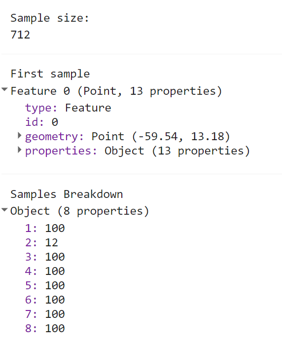
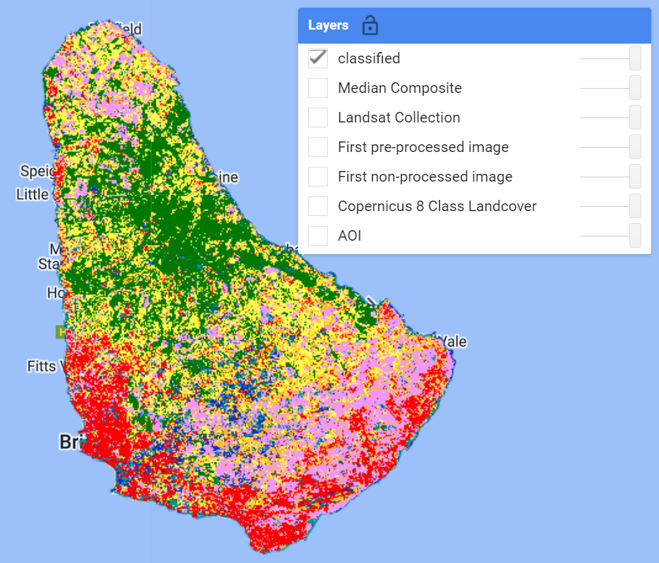
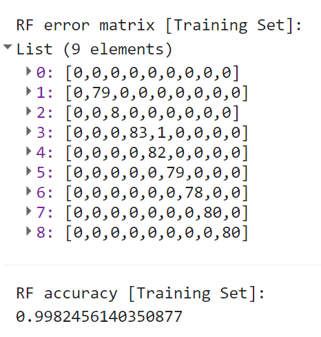
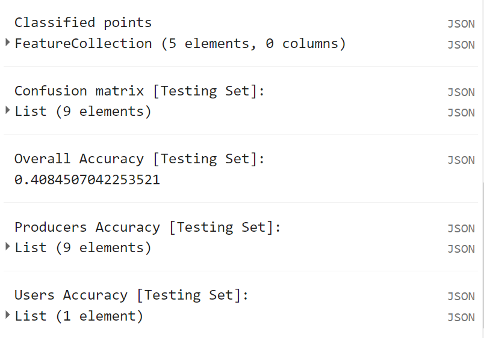

# Step-Through Part 2

## Generate Sample Data

Recall, that we have already loaded our land cover reference dataset at the beginning of Part 1 - it is the 8 Class derived Copernicus Land Cover dataset. To extract sample points to train and validate the model, we need both the predictor variables and the response variable (the phenomenon we are trying to classify). As these both already are ee.Images, we can simply add them together, then use 
`.stratifiedSample()` to sample a certain amount of points per class. 

Finally, we'll print a few objects to the console to see what our sample points look like. 

```javascript
// --------------------------------------------------------------
// Create reference sample points for model training and testing
// --------------------------------------------------------------

var label = 'class'; // our Y variable - or the variable we want to classify
var samples = composite
.addBands(refLandCover) // stack land cover img with predictor bands
.stratifiedSample({ // create a stratified random sample of points 
  numPoints:100, 
  classBand:label, 
  region:aoi, 
  scale:30, 
  projection:'EPSG:3857', 
  seed:12, 
  // classValues:[1,2,3,4], // these override numPoints if defined
  // classPoints:[100,100,50,50], 
  dropNulls:true, 
  tileScale:2, 
  geometries:true})
  .randomColumn(); // create a random value property

print('Sample size: ',samples.size());
print('First sample',samples.first());
print('Samples Breakdown',samples.aggregate_histogram(label));
```



You may notice the the Sample Breakdown may be imbalanced across all classes. While we request the same number of points setting `numPoints`, the natural area representation of each class likely differs a lot. In these cases, you may want to 'oversample' rare classes and 'undersample' common classes. This can be done by defining `classValues` and `classPoints` in `.stratifiedSample()`.

## Split into Train/Test

We will now split the samples into a training set and a test set, using the 'random' property assigned to the samples object in the previous code block. Here the split is 80/20 for train/test.

```javascript
//split sample data into training and testing
var training = samples.filter(ee.Filter.lte('random',0.8));
var testing = samples.filter(ee.Filter.gt('random',0.8));
print('training size: ', training.size());
print('testing size: ', testing.size());
```

## Train and Apply the Classifier

To construct our classifier of choice we call the specific function and enter any optional parameters 
(e.g. number of trees). We can then immediately train the classifier, specifying the training points to use (`training`), which property is the one to predict (`label`), and which properties are the predictor variables (`bands`). All three of these are variables we've defined somewhere above in the script already.

Finally, in one line of code we take the Landsat composite, select the predictor bands, and classify it using the trained classifier.

```javascript
// train the classifier
var classifier = ee.Classifier.smileRandomForest({
  numberOfTrees:100})
  .train({
    features:training,
    classProperty: label,
    inputProperties:bands
  });

// run the classification
var classified = composite.clip(aoi).select(bands).classify(classifier);

// Display the results, adjust colors according to your land cover stratification
// Map.centerObject(classified,12)
Map.addLayer(classified,lcViz,'classified');
```



## Accuracy Assessments

In order to assess the performance of our model, we can create an error matrix (or confusion matrix), detailing for every assessed point, what the 'true' label was, and what the label was predicted to be by the model. From this we can also compute Producer's Accuracy (1 - Omission rate), User's Accuracy (1 - Comission rate), and Overall Accuracy.

Here we will do it for the Training points set first.

```javascript
// -------------------------------------
// Accuracy Assessments
// -------------------------------------

// Compute training accuracy 
print('RF error matrix [Training Set]: ', classifier.confusionMatrix());
print('RF accuracy [Training Set]: ', classifier.confusionMatrix().accuracy());
```



Seem too good to be true? Of course, because these are the points the model was trained on, it has seen every one of these instances already. To get a better estimate of the model's ability to predict on unseen observations, we use the Testing set. 



You'll find these accuracy metrics to be a bit more in line with your own inspection of the result on the map.

Code Checkpoint: [https://code.earthengine.google.com/1c1a56cc7320e66578a6e8de67fa2f17](https://code.earthengine.google.com/1c1a56cc7320e66578a6e8de67fa2f17)

Congratulations! You have setup a Random Forest classifier for land cover mapping using multiple Landsat sensors. There are many ways to improve and/or modify your classification workflow. See the Challenges section!
